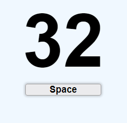

# Key Code Finder
This is a simple project that displays the key and its ASCII code, on the screen, whenever you press a key on keyboard.

A sample is shown below

For a live demo [click here](https://gmd144.github.io/key-code-finder/)
